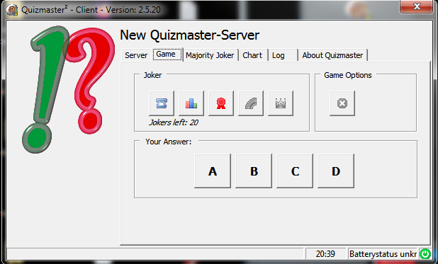
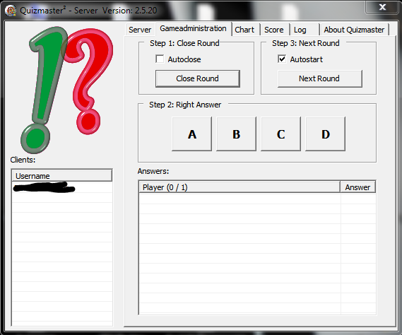

# Quizmaster²
This software started out as a fun weekend project. We used it extensively in our english lessons back in 2009-2011. Our teacher used to bring questionaire cards that always had four possible answers from A-D. Quickly we realized that playing this on a whiteboard would always lead to someone taking all the questions while other students just followed suit.

So i decided, since we were training to become IT-Specialists ;-) that it was time to create a software for this...

well ... the result was Quizmaster²

1. [Features](#Features)
    1. [Client](#Client)
    2. [Server](#Server)
3. [Installation](#Installation)
4. [Building the software](#Building-the-software)
5. [Screenshots](#Screenshots)

## Features 
### Client
- Can connect to the server application, once connected offers 4 Answer Buttons A through D
- Clients can revoke their answers and re-answer while the current game round is still open
- If enabled in the server, students might view a scoreboard
- For fun: The client offers several "Jokers"
  - Telephone Joker: "Call" one of the other students and ask them for a hint
  - Majority Joker: Before the game round closes you can view a chart and see how other students answered
  - Hero Joker: Can only be used once per game round and only by one student, who will then be responsible to answer for everyone. If answered correctly everyone gets one point and the hero gets two points. (Joker costs 2 credits)
- (Beta) Flipchart, can be used to type out a question if needed. Needs to be granted permission by the teacher
- On Laptop the client will show a clock and the battery charging status in its statusbar (see Kiosk mode)
- **KIOSK Mode**: Currently this can only be statically compiled into the software and not activated at runtime.  
In Kiosk mode students will not be able to see any other windows on their computer. This is implemented through a new virtual desktop. Also the client software will permanently scan all open windows on this special desktop. If it finds any window not part of Quizmaster² it will close this window.

### Server
- Can set specific servername, so multiple instances can run on any given network
- Can specify after how many rounds a Joker credit will be given to all students
- Can toggle the Scoreboard visibility on all clients
- Has a list of all connected Clients => rightclick to grant flipchart permission or kick a student from the Server
- Gameadministration Tab:
  - Decide if the software should handle closing game rounds automatically
  - Confirm the "right" answer
  - Either let the software start the next round or open next round manually
  - Will show how every student answered
- "Flipchart" can authorize messages that will be submitted by one student and send out to all other students
- Always show the overall score and percentage for all students (printable if third party pdf printer is installed)

## Installation
None :) Just download both the Client.exe and Server.exe
... or the *-KIOSK.exe Versions of each.  
*(Always use the correct applications together! Server-KIOSK.exe will work just like the Server.exe but only Kiosk Clients can connect to it - use this if you want to enforce clients running in KIOSK Mode)*

Distribute the Client.exe or Client-KIOSK.exe to the students.

## Building the software
To build the software yourself just open either the Client or the Server project file in Turbo Delphi 2006 and recompile the project...

ATTENTION: This will not compile on anything newer than (including) Delphi 2010. The network protocol is hard coded to assume 1byte ascii characters. I never found the time to correct this...

## Screenshots

